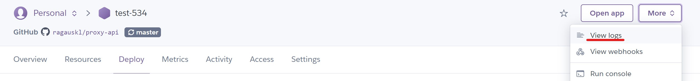

# Using the API

You can add additional endpoints for now it has 2:

* GET '/' - Welcome message
* GET '/proxy?url=...' - makes a request to specified URL and pipes it back to the client. Mostly used for avoiding CORS issues.

## Local environment

To run locally:
1. Run 'npm i'
2. If you want linter to work install VSCode extension [TSLint](https://marketplace.visualstudio.com/items?itemName=ms-vscode.vscode-typescript-tslint-plugin)
3. Run 'npm run dev'
4. The API should be available at 'localhost:3000'
   
Example usage in browser
```js
fetch(`http://localhost:3000/proxy?url=https://api.meteo.lt/v1/places`)
.then(async res => {
  console.log(await res.json())
})

// some URLs that contain certain characters found
// @ https://www.werockyourweb.com/url-escape-characters/
//, must be escaped as shown below:

fetch(`http://localhost:3000/proxy?url=${
  encodeURI('https://api.meteo.lt/v1/places')
}`)
.then(async res => {
  console.log(await res.json())
})
```

## Remote API

1. Deploy App to hosting service. Example [Deployment to Heroku](#deployment-to-heroku) described below

Example usage of Live API (According to Heroku deployment example)
```js
fetch(`https://test-534.herokuapp.com/proxy?url=https://api.meteo.lt/v1/places`)
.then(async res => {
  console.log(await res.json())
})
```

# Deployment to Heroku

1. Run 'npm run build' which will create 'dist' directory. This will compile TypeScript to JavaScript.
2. In Heroku create new App
3. Set App to Deploy from Github
   
4. For initial deploy click 'Deploy Branch' (master for example) and then 'Enable Automatic Deploys'
   
5. Go to logs and you should see 'API is running on port ...' when API is ready and can accept requests
   
   
6. You can also check if API is live if you go to 'Open App' it will make a GET requests to endpoint '/' which should return a 'welcome' message.
   
   

